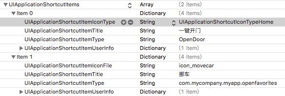

1. 图标按钮
*  在appDelegate中实现这个方法
```
    //3DTouch
    func application(_ application: UIApplication, performActionFor shortcutItem: UIApplicationShortcutItem, completionHandler: @escaping (Bool) -> Void) {
        if shortcutItem.type == "OpenDoor" {
            root?.openDoorBtn.sendActions(for: .touchUpInside)
        }
    }
```

* 在info.plist中实现一些属性


2. 程序内的3DTouch

```
    func previewingContext(_ previewingContext: UIViewControllerPreviewing, viewControllerForLocation location: CGPoint) -> UIViewController? {
        guard let index = tableView.indexPathForRow(at: location)else{
            return nil
        }

        let cell = tableView.cellForRow(at: index)
        let model = self.dataSource[index.row]
        let detailVC = NoticeDetailController()
        detailVC.model = model
        detailVC.preferredContentSize = CGSize(width:0,height:0)
        previewingContext.sourceRect = cell!.frame
        
        return detailVC
    }
```