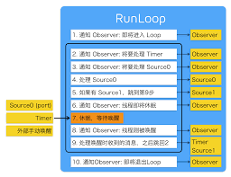

# RunLoop
## 简述
RunLoop类似一个do-while循环,可以使程序一直运行并接受用户输入,不同与do-while的是,RunLoop需要处理消息事件,没有消息时休眠,有消息时唤醒.这样可以节省CPU时间

* RunLoop和子线程的关系
- 子线程在创建完,run一次之后立即被销毁,因此需要将子线程加入到RunLoop中.
- 每个线程(包括主线程都有一个自动创建的RunLoop),app不能创建和管理Runloop,通过current方法获取当前线程的RunLoop.另外RunLoop不是线程安全的,只能在当前线程中使用.

## 应用
- NSTimer和scrollview的问题
- 检测UI卡顿:通过在子线程检测主线程的RunLoop,判断两次状态之间耗时是否达到阈值.也可以采用FPS监控
- AutoReleasePool:
注册两个observer,第一个监听进入Loop,第二个监听进入休眠和退出Loop;
进入时,创建AutoreleasePool,休眠时释放旧池创建新池,退出时释放AutoreleasePool;
创建时优先级最高,保证再其他操作之前,释放时优先级最低,保证释放在所有回调之后.

## 其他
1. RunLoop与GCD的关系
`dispatch_async(dispatch_get_main_queue(), <#^(void)block#>)`,向主线程的RunLoop发送消息唤醒RunLoop,同After延时.

***

## RunLoop的组成
包括如下5个类:
- CFRunLoopRef
- CFRunLoopModeRef
- CFRunLoopObserverRef
- CFRunLoopSourceRef
- CFRunLoopTimerRef


</center>

>RunLoop管理Mode,mode代表的是RunLoop的运行模式,它管理各个事件,mode中包含source0,source1,timer,observer和port.
***
各个类分析如下:

CFRunLoopModeRef

CFRunLoopMode结构如下:

    ```c
    struct __CFRunLoopMode {
        CFStringRef _name;            // mode名称
        CFMutableSetRef _sources0;    // sources0
        CFMutableSetRef _sources1;    // sources1
        CFMutableArrayRef _observers; // 通知
        CFMutableArrayRef _timers;    // 定时器
        __CFPortSet _portSet;  // 保存所有需要监听的port，比如 _wakeUpPort，_timerPort都保存在这个数组中
    };
    ```

- 每次启动 RunLoop 时，只能指定其中一个 Mode，这个就是 CurrentMode。要切换 Mode，只能退出 Loop，再重新指定一个 Mode 进入,这样做事分隔开不同组的Source/Timer/Observer,使其互不影响。
- Mode的类型有5个,暴露出来的就只有前两个
    * NSDefaultRunLoopMode：App的默认Mode，通常主线程是在这个Mode下运行；
    * NSRunLoopCommonModes:默认包括,default和eventTracking
    * NSConnectionReplyMode
    * NSModalPanelRunLoopMode
    * NSEventTrackingRunLoopMode
- CFRunLoop对外暴露的Mode管理接口有两个
    ```c
    CFRunLoopAddCommonMode(CFRunLoopRef runloop, CFStringRef modeName);
    CFRunLoopRunInMode(CFStringRef modeName, ...);
    ```
***

1. CFRunLoopSourceRef

    Source0,处理App内部事件,App自己负责管理,也就是自己写的方法等
Source1,由RunLoop和内核管理,能主动唤醒RunLoop的线程
应用 1. 常驻线程  2. 崩溃弹窗

2. CFRunLoopObserverRef

    观察者,状态发生变化时,通过回调接受到变化.
能观测的时间点
```c
enum CFRunLoopActivity {
    kCFRunLoopEntry             = (1 << 0),    // 即将进入Loop   
    kCFRunLoopBeforeTimers 		= (1 << 1),    // 即将处理 Timer    	
    kCFRunLoopBeforeSources		= (1 << 2),    // 即将处理 Source  
    kCFRunLoopBeforeWaiting		= (1 << 5),    // 即将进入休眠     
    kCFRunLoopAfterWaiting 		= (1 << 6),    // 刚从休眠中唤醒   
    kCFRunLoopExit              = (1 << 7),    // 即将退出Loop  
    kCFRunLoopAllActivities		= 0x0FFFFFFFU  // 包含上面所有状态  
};
typedef enum CFRunLoopActivity CFRunLoopActivity;
```
应用:1. 利用RunLoop空闲时间储存数据 2. 检测UI卡顿

3. CFRunLoopTimerRef
其实就是NSTimer,加入RunLoop的时候会注册对应时间点,时间点到的时候唤醒执行回调.

内部逻辑如下:

</center>

## 面试题
1.谈谈runloop的理解；
2.runloop有哪些状态；
3.RunLoop的作用是什么？它的内部工作机制了解么？（最好结合线程来说） 
4.TableView/ScrollView/CollectionView滚动时为什么NSTimer会停止？
5.RunLoop和线程有什么关系？

参考:
https://developer.apple.com/documentation/foundation/runloop
https://developer.apple.com/library/archive/documentation/Cocoa/Conceptual/Multithreading/RunLoopManagement/RunLoopManagement.html
https://juejin.im/post/5c9e28ddf265da307261efff

