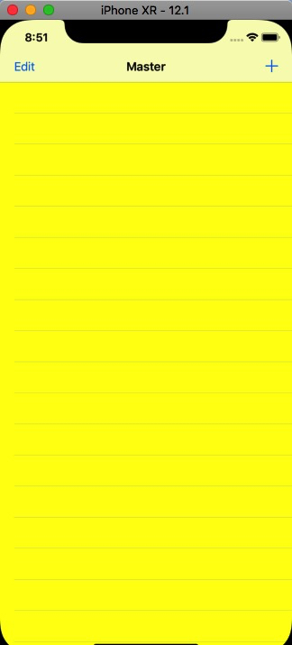
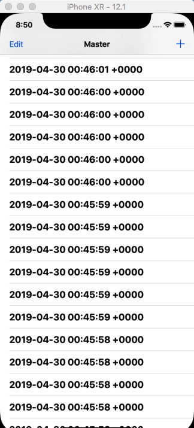

# edgesForExtendedLayout,contentInsetAdjustmentBehavior,automaticallyAdjustsScrollViewInset属性总结

无可滚动的View时,配合使用edgesForExtendedLayout,extendedLayoutIncludesOpaqueBars.

在有可滚动的View时,edgesForExtendedLayout负责控制Table的覆盖区域,automaticallyAdjustsScrollViewInsets负责滚动的区域是否被bar挡住.

1. edgesForExtendedLayout

此属性是指定view的边延伸的位置,默认值是All
```
typedef enum : NSUInteger {
   UIRectEdgeNone   = 0,
   UIRectEdgeTop    = 1 << 0,
   UIRectEdgeLeft   = 1 << 1,
   UIRectEdgeBottom = 1 << 2,
   UIRectEdgeRight  = 1 << 3,
   UIRectEdgeAll = UIRectEdgeTop | UIRectEdgeLeft | UIRectEdgeBottom | UIRectEdgeRight 
} UIRectEdge;
```
注意:它只有当viewController被嵌到别的container view controller中时才会起作用

2. automaticallyAdjustsScrollViewInsets(**此属性只适用于可滚动的View**)

* table从navigationBar底部开始并且滚动的时候能延伸到整个屏幕
* 适用于view是ScrollView或其子View
* 无论是true或者false,table滚动都是覆盖整个屏幕,区别是否会被导航条挡住

该属性已经弃用,新属性scrollview的contentInsetAdjustmentBehavior,可选值有never,always,automatic,scrollableAxes.
后两个是自动调整,以及只在滚动方向上调整.

例如:

```
self.tableView.contentInsetAdjustmentBehavior = .never
```
<center class="half">

 &emsp; &emsp;      

</center>

如图一可见,
设置为never时,table是覆盖整个界面的,而导航条挡到了内容.
默认情况是,table也是覆盖整个界面的,导航条不会挡到内容.

3. extendedLayoutIncludesOpaqueBars

对前两个的补充,navigationBar不透明时是否依然延伸
edgesForExtendedLayout是UIRectEdgeAll,并且此属性为false,就不会延伸到不透明的Bar