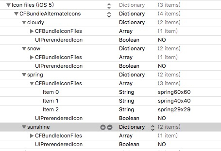

# 更新图标
1. 

```
    func changeAppIcon(name:String?){
        if #available(iOS 10.3, *) {
            if !UIApplication.shared.supportsAlternateIcons {
                return
            }
            UIApplication.shared.setAlternateIconName(name) { (error) in
                if (error != nil) {
                    print("更换图标失败: \(error!)")
                }
            }
        } else {
            return
        }
    }
```

2. info

